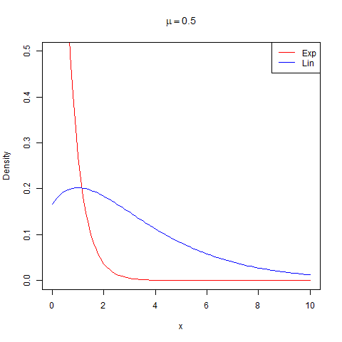
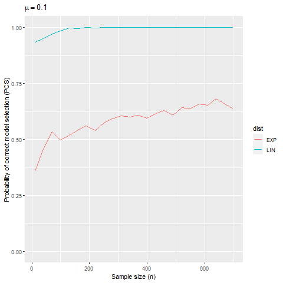

```{r setup, include=FALSE}
knitr::opts_chunk$set(echo = TRUE)
```

## Objective

In this document we explore via simulation the $T$ statistic proposed by Chowdhury, Marozzi and Marmolejo-Ramos to distinguish beetween exponential and Lindley distribution but in the case of regression models.

Some of the R packages used here are:

```{r message=FALSE}
library(RelDists) # Which has the LIN distribution
library(gamlss)   # To fit regression models
```

## Exploring some cases where exponential and Lindley pdfs overlap

Below are the pdf for exponential and Lindley distribution with parameter $\mu$ (not $\lambda$ and $\theta$).

\begin{equation}
\begin{split}
f_{Exp}(x;\mu) &= \mu e^{-\mu x}, \\
f_{Lin}(x;\mu) &= \frac{\mu^2}{1+\mu}\left(1+x\right) e^{-\mu x},
\end{split}
\end{equation}

where $x>0$ and $\mu>0$.

For these distributions the expected values are $E_{Exp}(X)=\frac{1}{\mu}$ and $E_{Lin}(X)=\frac{\mu+2}{\mu(\mu+1)}$.

In the next code we explore graphically the behaviour of $E(X)$ given the parameter $\mu$.

```{r}
mean_exp <- function(mu) 1/mu
mean_lin <- function(mu) (mu + 2) / (mu * (mu + 1))

curve(mean_exp, from=0, to=10, col="red",
      xlab=expression(mu), ylab="E(X)", ylim=c(0, 5))
curve(mean_lin, col="blue", add=TRUE)
legend("topright", legend=c("Exp", "Lin"), lty=1, col=c("red", "blue"))
```

From this figure we note that $E(X)$ for exponential and Lindley have the same pattern as $\mu$ increases.

The next code is used to create a .gif animation with the pdfs for several values of $\mu$.

```{r eval=FALSE}
library(animation)
## make sure ImageMagick has been installed in your system
saveGIF({
  mus <- seq(from=0.5, to=1.5, by=0.05)
  for (mu in mus) {
    curve(dEXP(x, mu=mu), from=0, to=10, col="red", ylim=c(0, 0.5),
          ylab="Density", main=bquote(mu == .(mu)))
    curve(dLIN(x, mu=mu), from=0, to=10, col="blue", add=TRUE)
    legend("topright", legend=c("Exp", "Lin"), lty=1, col=c("red", "blue"))
}
})
```




From this .gif we can note that pdfs are quite similar for values around $\mu=1$.

## Functions to generate dataframe from exponential and Lindley regression models

Observing the animation we conclude that $\mu=1$ is an appropiate value to generate pdfs that overlaps. So, we are going to create a linear predictor using the $\log$ link function and two hypothetical covariates $X_1 \sim U(0, 1)$ and $X_2 \sim U(0, 1)$ to emulate a regression model with $\mu=1$.

If we use this structure $\log(\mu) = 0.5 + 2 \times X_1 - 3 \times X_2$ for the linear predictor, we ensure that $\mu \approx 1$ because the covariates $X_1$ and $X_2$ have mean of 0.5. Below is the procedure to check if $\mu \approx 1$.

\begin{equation}
\begin{split}
\log(\mu) &= 0.5 + 2 \times X_1 - 3 \times X_2, \\
\log(\mu) &\approx 0.5 + 2 \times 0.5 - 3 \times 0.5, \\
\mu       &\approx \exp(0.5 + 2 \times 0.5 - 3 \times 0.5), \\
\mu       &\approx \exp(0.5 + 1 - 1.5), \\
\mu       &\approx \exp(0), \\
\mu       &\approx 1,
\end{split}
\end{equation}

So the parameters $\beta_0=0.5$, $\beta_1=2$ and $\beta_2=-3$ ensure that $Y$ could have $\mu \approx 1$.

The next functions are used to simulate dataframes with response variable $Y$ distributed as exponential and Lindley.

```{r}
gen_data_exp <- function(n) {
  x1 <- runif(n=n)
  x2 <- runif(n=n)
  eta <- 0.5 + 2 * x1 - 3 * x2
  mu <- 1/exp(eta)
  y <- rEXP(n=n, mu=mu)
  data.frame(y=y, x1=x1, x2=x2)
}

gen_data_lin <- function(n) {
  x1 <- runif(n=n)
  x2 <- runif(n=n)
  eta <- 0.5 + 2 * x1 - 3 * x2
  mu <- exp(eta)
  y <- rLIN(n=n, mu=mu)
  data.frame(y=y, x1=x1, x2=x2)
}
```

## Example of using `gen_data_exp` and `gen_data_lin` functions

Here we simulate a dataframe from Lindley distribution and then we estimate the parameters $\beta_0=0.5$, $\beta_1=2$ and $\beta_2=-3$.

```{r}
data <- gen_data_lin(n=5000)
mod1 <- gamlss(y ~ x1 + x2, family=LIN, data=data,
               control=gamlss.control(trace=FALSE))
coef(mod1)
```

From the last result we observe that the estimations are quite similar to $\beta_0=0.5$, $\beta_1=2$ and $\beta_2=-3$.

## Functions for the simulation study

The next function is used to fit both models and obtain the $T$ statistic.

```{r}
# To simulate one time
obtain_one_T <- function(n, dist) {
  # To simul data
  if (dist == "EXP")
    data <- gen_data_exp(n=n)
  else
    data <- gen_data_lin(n=n)
  # To fit both models
  mod1 <- gamlss(y ~ x1 + x2, family=LIN, data=data,
                 control=gamlss.control(trace=FALSE))
  mod2 <- gamlss(y ~ x1 + x2, family=EXP, data=data,
                 control=gamlss.control(trace=FALSE))
  # To obtain T
  T <- as.numeric(logLik(mod2) - logLik(mod1))
  return(T)
}

# To repeat nrep times
obtain_multiple_T <- function(n, nrep, dist) {
 replicate(n=nrep, obtain_one_T(n=n, dist=dist)) 
}
```

## Simulation study

We explore the $T$ statistic for several values of the sample size $n$.

```{r}
n <- seq(from=10, to=700, by=30)
```

Next we are going to simulate `nrep` datasets from a regression model with response variable EXPonential or LINdley, then obtain the percentage in which $T$ identifies correctly the true distribution.

```{r eval=FALSE}
library(purrr)

nrep <- 1000

# This is the core of the simulation
T_exp <- map(n, obtain_multiple_T, nrep=nrep, dist="EXP")
T_lin <- map(n, obtain_multiple_T, nrep=nrep, dist="LIN")

# If T > 0, Exponential model is selected, else Lindley model is selected
T_exp <- map(T_exp, function(x) mean(x > 0))
T_lin <- map(T_lin, function(x) mean(x <= 0))

# To obtain vectors with the percentage of correct selection PCS
T_exp <- unlist(T_exp)
T_lin <- unlist(T_lin)
```

Next we create a dataframe with the results.

```{r eval=FALSE}
results <- data.frame(pcs=c(T_exp, T_lin), 
                      n=n, 
                      true_dist=rep(x=c("Exp", "Lindley"), 
                                    each=length(n)))
```

```{r echo=FALSE}
results <- read.table("results_mu_1.txt", header=TRUE)
```

Finally we plot the results.

```{r}
library(ggplot2)
ggplot(results, aes(x=n, y=pcs, color=true_dist)) + 
  geom_line() +
  labs(y = "Probability of correct model selection (PCS)",
       x = "Sample size (n)") +
  ylim(0, 1)
```

- Both PCS curves go to one as $n$ increases.
- For $n \geq 200$ PCS is at least 80%.

## Extending the simulation study for other values of $\mu$

In the simulation study we used $\mu$ with the next structure

$$\mu \approx \exp(0.5 + 2 \times X_1 - 3 \times X_2) \approx 1,$$

where $X_1 \sim U(0, 1)$ and $X_2 \sim U(0, 1)$. 

To obtain the $\mu$ values 0.1, 0.5, 0.9, 1.3, 1.5, 2.0, 2.5 reported in the table 3 and 4 in the working paper, we can use the next $\beta_0$ values:

```{r}
beta0 <- c(-1.8, -0.2, 0.4, 0.8, 0.9, 1.2, 1.4)
mu <- round(exp(beta0 + 2 * 0.5 -3 * 0.5), digits=1)
cbind(beta0=beta0, mu=mu)
```

We repeated the simulation study shown in the last section for $\mu$ with approximate values of 0.1, 0.5, 0.9, 1.3, 1.5, 2.0, 2.5. The results are shown below.




